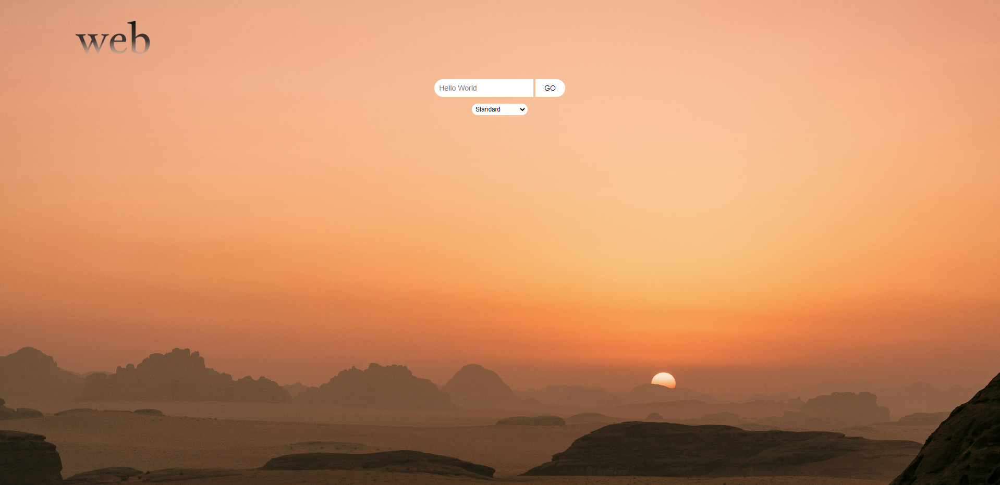

# Description 
Ascii-art-web is to create and run a server to run a web-based GUI (graphical user interface) version of our latest ascii-art project. This project also includes all additional tasks such as: stylize, dockerize and export file. We have tried to follow the best practices, knowledge and features available to us. We are waiting for your suggestions, adequate criticism and comments.

# Preview




# Getting started

## Clone the repository 
```
git clone НЕ ЗАБЫТЬ ССЫЛКУ СЮДА ВСТАВИТЬ. 
```

## Usage 

While in the root directory of the project, type in the console 
```
go run cmd/main.go
```  

# Authors
Janika Pruel && Daniil Mjodov 

With respect
BugMakers Team